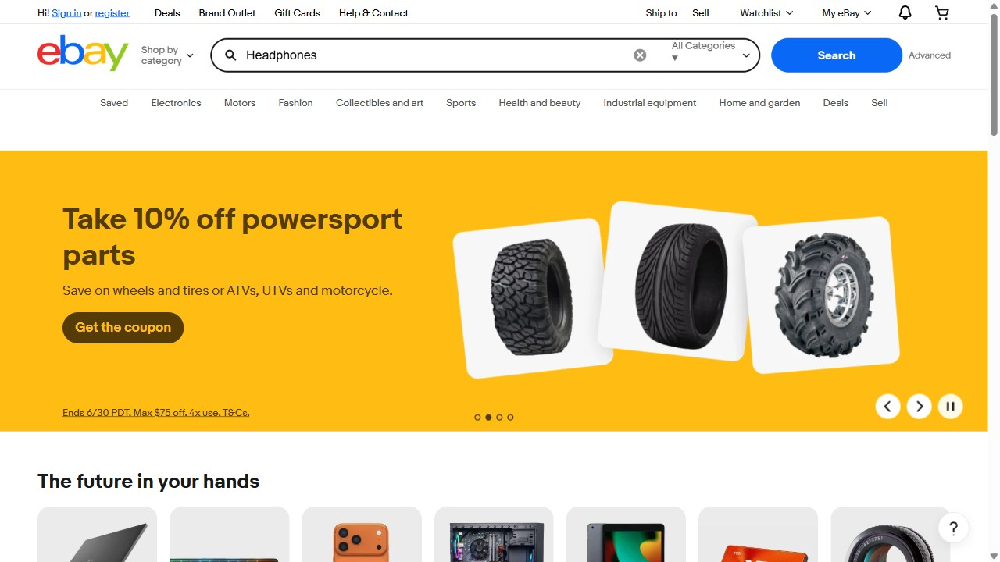
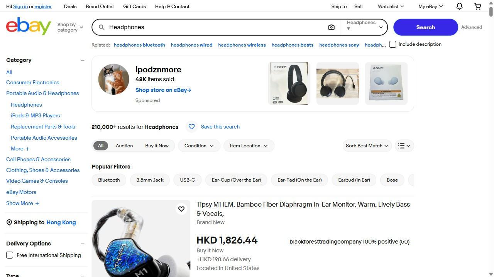

# Midscene Report

- SDK Version: 1.10.0
- Execution count: 7

## Suggested execution markdown files
- 1-Act----Headphones.md (Act - 在搜索框输入 "Headphones"，然后回车)
- 2-Tap---the-search-bar-labeled-Search-for-anything.md (Tap - the search bar labeled 'Search for anything')
- 3-Input.md (Input)
- 4-Tap---the-blue-Search-button.md (Tap - the blue 'Search' button)
- 5-WaitFor---waitFor-.md (WaitFor - waitFor: 列表中至少出现一个耳机商品)
- 6-Query----title-string-price-number--.md (Query - { title: string, price: number }[], 列表中的耳机商品)
- 7-Assert---.md (Assert - 页面左侧有一个分类筛选栏)

# Act - 在搜索框输入 "Headphones"，然后回车

- Execution start: 2026-06-23T14:09:44.550Z
- Task count: 1

## 1. LoadYaml - 在搜索框输入 "Headphones"，然后回车
- Status: finished
- Start: 2026-06-23T14:09:44.566Z
- End: 2026-06-23T14:09:44.762Z
- Cost(ms): 196
- Screen size: 1280 x 720

### Recorder
- #1 type=screenshot, ts=2026-06-23T14:09:44.762Z, timing=after-calling

---

# Tap - the search bar labeled 'Search for anything'

- Execution start: 2026-06-23T14:09:44.766Z
- Task count: 2

## 1. Locate - the search bar labeled 'Search for anything'
- Status: finished
- Start: 2026-06-23T14:09:44.768Z
- End: 2026-06-23T14:09:44.831Z
- Cost(ms): 63
- Screen size: 1280 x 720
- Locate center: (557, 71)

## 2. Tap - the search bar labeled 'Search for anything'
- Status: finished
- Start: 2026-06-23T14:09:44.832Z
- End: 2026-06-23T14:09:45.447Z
- Cost(ms): 615
- Screen size: 1280 x 720

### Recorder
- #1 type=screenshot, ts=2026-06-23T14:09:45.447Z, timing=after-calling

---

# Input

- Execution start: 2026-06-23T14:09:45.449Z
- Task count: 1

## 1. Input - Headphones
- Status: finished
- Start: 2026-06-23T14:09:45.450Z
- End: 2026-06-23T14:09:46.119Z
- Cost(ms): 669
- Screen size: 1280 x 720

### Recorder
- #1 type=screenshot, ts=2026-06-23T14:09:46.119Z, timing=after-calling

---

# Tap - the blue 'Search' button

- Execution start: 2026-06-23T14:09:46.122Z
- Task count: 2

## 1. Locate - the blue 'Search' button
- Status: finished
- Start: 2026-06-23T14:09:46.123Z
- End: 2026-06-23T14:09:46.190Z
- Cost(ms): 67
- Screen size: 1280 x 720
- Locate center: (1071, 71)

## 2. Tap - the blue 'Search' button
- Status: finished
- Start: 2026-06-23T14:09:46.191Z
- End: 2026-06-23T14:09:49.338Z
- Cost(ms): 3147
- Screen size: 1280 x 720

### Recorder
- #1 type=screenshot, ts=2026-06-23T14:09:49.338Z, timing=after-calling

---

# WaitFor - waitFor: 列表中至少出现一个耳机商品

- Execution start: 2026-06-23T14:09:49.340Z
- Task count: 1

## 1. WaitFor - 列表中至少出现一个耳机商品
- Status: finished
- Start: 2026-06-23T14:09:49.341Z
- End: 2026-06-23T14:09:58.396Z
- Cost(ms): 9055
- Screen size: 1280 x 720

### Recorder
- #1 type=screenshot, ts=2026-06-23T14:09:58.396Z, timing=after-calling

---

# Query - { title: string, price: number }[], 列表中的耳机商品

- Execution start: 2026-06-23T14:09:58.400Z
- Task count: 1

## 1. Query - { title: string, price: number }[], 列表中的耳机商品
- Status: finished
- Start: 2026-06-23T14:09:58.401Z
- End: 2026-06-23T14:10:05.092Z
- Cost(ms): 6691
- Screen size: 1280 x 720

### Recorder
- #1 type=screenshot, ts=2026-06-23T14:10:05.092Z, timing=after-calling

---

# Assert - 页面左侧有一个分类筛选栏

- Execution start: 2026-06-23T14:10:05.096Z
- Task count: 1

## 1. Assert - 页面左侧有一个分类筛选栏
- Status: finished
- Start: 2026-06-23T14:10:05.097Z
- End: 2026-06-23T14:10:08.290Z
- Cost(ms): 3193
- Screen size: 1280 x 720

### Recorder
- #1 type=screenshot, ts=2026-06-23T14:10:08.290Z, timing=after-calling

